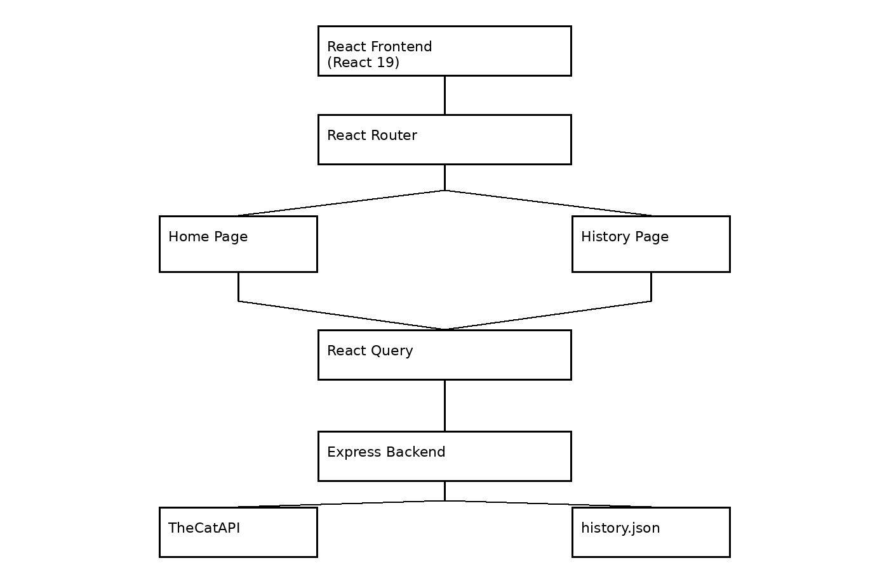

# CatBeauty

CatBeauty is a full-stack React application built as part of the  Frontend / Full-Stack Developer Challenge.

The application consumes TheCatAPI, displays cat images in an Instagram-style interface, supports infinite scrolling, breed filtering, detailed modal views, and implements a persistent click-history system backed by a custom REST API.

---

# Tech Stack

## Frontend

* React 19
* Vite
* TypeScript
* Material UI
* Tailwind CSS
* React Query
* React Router

## Backend

* Express.js
* TypeScript

## External APIs

* TheCatAPI

---

# Architecture Overview

Frontend (React SPA)

* Home Page
* History Page
* React Router
* React Query

Backend (Express)

* Cat API proxy
* History CRUD API
* Persistent history storage

Persistence

* Local JSON storage (`server/data/history.json`)

# Workflow Diagram



---

# Project Structure

```text
src/
├── components/
├── pages/
├── services/
├── types/

server/
├── data/
│   └── history.json
├── index.ts
```

---

# Requirements

Install Node.js:

### macOS

```bash
brew install node
```

### Windows

Download from:

https://nodejs.org/

Verify installation:

```bash
node -v
npm -v
```

---

# Installation

Clone repository:

```bash
git clone https://github.com/jmerinoh/CatBeauty.git
cd CatBeauty
```

Install dependencies:

```bash
npm install
```

---

# Environment Variables

Create an account at:

https://thecatapi.com/

After registration, TheCatAPI sends an API key by email.

Create:

```bash
server/.env
```

Add:

```env
CAT_API_KEY=live_xxxxxxxxxxxxxxxxxxxxxxxxx
```

Do not commit the `.env` file.

---

# Running the Application

Start frontend and backend:

```bash
npm run dev
```

Frontend:

```text
http://localhost:5173
```

Backend:

```text
http://localhost:3001
```

---

# Phase 1 Features

## Breed Filtering

* Loads breeds from TheCatAPI.
* Updates the cat grid when a breed is selected.

## Featured Cat

* Displays a random cat from a random breed.
* Changes on page refresh.

## Infinite Scroll

* Loads additional images while scrolling.
* Uses API pagination.

## Responsive Layout

* Mobile-first responsive design.
* Material UI + Tailwind CSS.

## Cat Details Modal

Displays:

* Breed name
* Large image
* Breed description

Fallback information is shown when breed metadata is unavailable.

---

# Phase 2 Features

## Click History

Every time a modal is opened:

* A history record is created.
* The record is stored persistently.
* The action survives browser refreshes and application restarts.

Each record stores:

* Image ID
* Image URL
* Breed Name
* Timestamp

## History View

Accessible via:

```text
/history
```

Displays:

* Thumbnail
* Breed Name
* Timestamp
* Edit Action
* Delete Action

History records are sorted newest-first.

## Routing

Routes:

```text
/
/history
```

Navigation:

* Logo → Home
* History button → History page

## Persistent Storage

History data is stored in:

```text
server/data/history.json
```

This allows persistence without requiring a database.

---

# REST API

## Cat Endpoints

```http
GET /api/breeds
GET /api/cats
GET /api/featured-cat
```

## History CRUD Endpoints

```http
GET    /api/history
POST   /api/history
PUT    /api/history/:id
DELETE /api/history/:id
```

These endpoints were implemented to demonstrate multiple API operations beyond simple GET requests.

---

# State Management

The project uses React Query for server-state management.

Reasons:

* Request caching
* Automatic loading states
* Mutation support
* Query invalidation
* Reduced boilerplate
* Cleaner synchronization between frontend and backend

This satisfies the Senior-level structured state management requirement.

---

# Design Decisions

## Why Express?

Express provides:

* Minimal setup
* Lightweight architecture
* Fast implementation
* Clear REST API structure

Appropriate for the challenge scope.

## Why React Query?

React Query simplifies:

* Server-state synchronization
* CRUD mutations
* Loading management
* Error handling

Compared to manually managing API state.

## Why JSON Persistence?

Using a JSON file:

```text
server/data/history.json
```

Provides:

* Persistence across restarts
* Simple implementation
* No database dependency
* Easy inspection during evaluation

---

# Assumptions

* TheCatAPI may return images without breed metadata.
* Some breeds may not have associated images.
* The application is intended for a single-user environment.
* Authentication is outside the challenge scope.

---

# Limitations

* No authentication.
* No authorization.
* No database.
* No automated tests.
* No deployment.
* No history pagination.
* No duplicate history prevention.

---

# QA Notes

Validated:

* Breed filtering
* Infinite scrolling
* Modal display
* Featured cat randomization
* History creation
* History update
* History deletion
* History persistence
* Route navigation
* Responsive layouts

Resolved During Development:

* Modal closing due to Vite file watcher reload.
* Missing breed metadata in modal and history.
* Featured cat random-breed edge case producing 404 responses.

---

# Additional Libraries Used

## Material UI

Used for:

* Layout
* Dialogs
* Cards
* Buttons
* Typography

## Tailwind CSS

Used for:

* Responsive layouts
* Utility-first styling

## React Router

Used for:

* Home route
* History route

## React Query

Used for:

* Server-state management
* CRUD operations
* Cache invalidation

---

# Workflow Diagram

 

---

# Author

Jorge Merino

Frontend / Full-Stack Developer Challenge Submission
